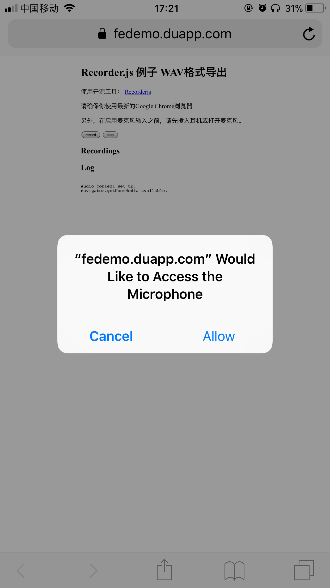

# 07_HTML5录音demo

此API兼容性普及度不行，见：https://caniuse.com/#search=MediaStream

注意事项：

- 浏览器支持 [MediaRecorder_API](https://developer.mozilla.org/en-US/docs/Web/API/MediaRecorder_API)
- 协议为HTTPS或者本地localhost，参见：https://developers.google.com/web/updates/2016/01/mediarecorder

所以使用https协议打开demo预览页面：https://fedemo.duapp.com/demo%E7%BB%83%E4%B9%A0/07_HTML5%E5%BD%95%E9%9F%B3demo/index.html

## DEMO

