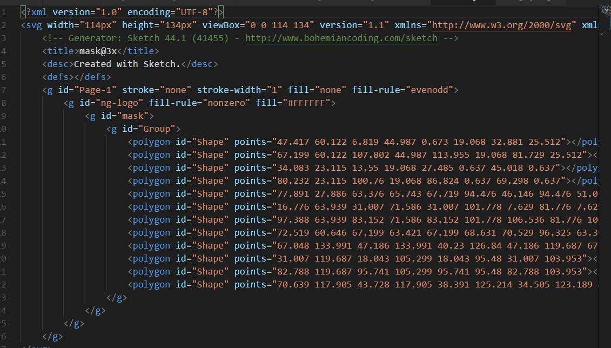
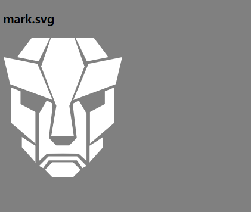

# 17_svg_加载图标制作

使用技术，SVG文章参考 <a href="https://developer.mozilla.org/zh-CN/docs/Web/SVG">可缩放矢量图形（Scalable Vector Graphics，SVG)</a>

类似svg技术的demo有`10_svg飞行图、迁徙图`

## svg图标制作介绍

### 1、svg文件代码说明

```html

<?xml version="1.0" encoding="utf-8"?>
<!-- Generator: Adobe Illustrator 15.0.0, SVG Export Plug-In . SVG Version: 6.00 Build 0)  -->
<!DOCTYPE svg PUBLIC "-//W3C//DTD SVG 1.1//EN" "http://www.w3.org/Graphics/SVG/1.1/DTD/svg11.dtd">
<svg version="1.1" xmlns="http://www.w3.org/2000/svg" xmlns:xlink="http://www.w3.org/1999/xlink" x="0px" y="0px"
	 width="200px" height="200px" viewBox="0 0 200 200" enable-background="new 0 0 200 200" xml:space="preserve">

</svg>
```

如上图代码，不需要手写的，只需要通过软件随便将一个图片生成导出svg格式文件即可，代码中有个注释`<!-- Generator: Adobe Illustrator 15.0.0, SVG Export Plug-In . SVG Version: 6.00 Build 0)  -->`。可以看出，改标签是用软件`Adobe Illustrator 15.0.0`来生成的。

有软件就用软件方便一些，没有就网上搜关键字`在线jpg转svg`或`在线png转svg`，比如[在线jpg,png图片转SVG工具-BeJSON.com](https://www.bejson.com/convert/image_to_svg/)

转成svg后，右键用文本编辑器或者代码IDE软件打开，即可看到里边的svg代码，如图：


看到图片中svg标签下包含很多`<polygon id="Shape" points="47.417 60.122 6.819 44.987 0.673 19.068 32.881 25.512"></polygon>`这样的代码，其实是一个图形，图形的形状是由points坐标点来绘制的。`mask.svg`文件形状如图：



### 2、动画效果svg

svg可以通过[linearGradient](https://developer.mozilla.org/en-US/docs/Web/SVG/Element/linearGradient)标签来绘制线性渐变，用于图形元素的填充或描边。渐变有些类似CSS3的属性`linear-gradient()`

```html
<linearGradient id="Shape_1_" gradientUnits="userSpaceOnUse" x1="-392.521" y1="4.1646" x2="-392.0605" y2="4.5428" gradientTransform="matrix(147.7263 0 0 198.7057 58043.5078 -771.4204)">
	<stop  offset="0" style="stop-color:#ffffff"/>
	<stop  offset="1" style="stop-color:#ffffff"/>
</linearGradient>
```

也可以使用[animateTransform](https://developer.mozilla.org/zh-CN/docs/Web/SVG/Element/animateTransform)元素变动了目标元素上的一个变形属性，从而允许动画控制转换、缩放、旋转或斜切。

demo为我们通过一个`biang.svg`在旋转的代码：

```
 <animateTransform attributeName="transform" begin="0s" dur="5s" type="rotate" from="0 27 27" to="360 27 27" repeatCount="indefinite"/>

```

`from="0 27 27" to="360 27 27"`中，表示从……到……变化，0和360表示角度，27表示圆心点，起点和终点都一致就是绕圆心旋转，如果做线性运动，可以通过属性`path`来指定路径，如demo1.svg为情况一，demo2.svg为情况二


## DEMO效果

见 https://fedemo.duapp.com
