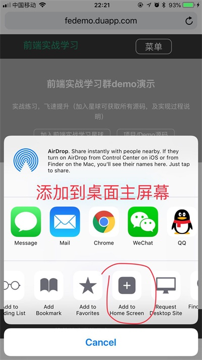
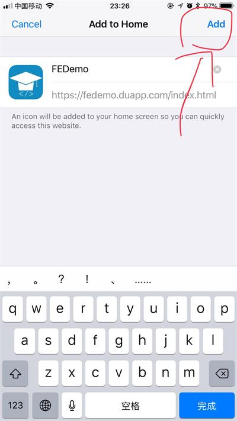
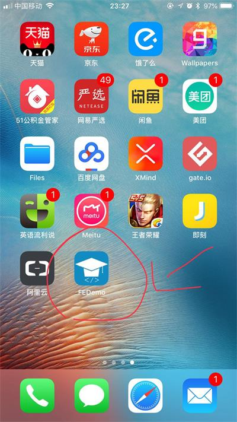
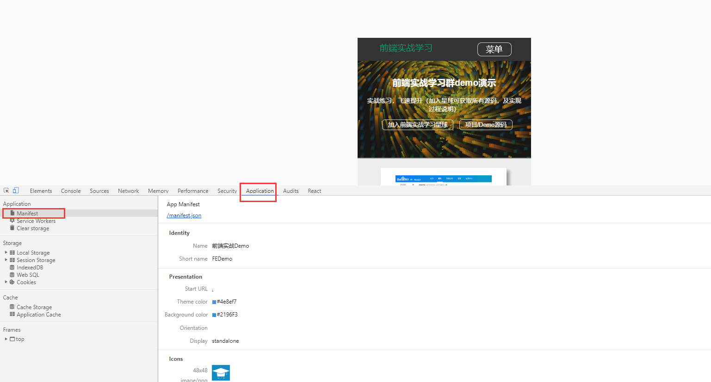

# PWA之网络应用清单Demo

本次demo主要学习`manifest.json`，也称为网络应用清单。该技术内容属于`PWA(Progressive Web Application)`的重点内容之一

官方相关的文档资料：

- [谷歌:网络应用清单](https://developers.google.com/web/fundamentals/web-app-manifest/)
- [mozilla-MDN:部署一个 manifest](https://developer.mozilla.org/zh-CN/docs/Web/Manifest)

## 截图演示








## 代码说明

_这里举例`fedemo.duapp.com`演示站的代码_

工程目录下添加`manifest.json`文件，内容如下:

```json
{
    "name": "前端实战Demo",
    "short_name": "FEDemo",
    "start_url": ".",
    "display": "standalone",
    "background_color": "#2196F3",
    "theme_color": "#4e8ef7",
    "description": "前端实战学习.",
    "icons": [{
            "src": "./images/touch/homescreen48.png",
            "sizes": "48x48",
            "type": "image/png"
        },
        {
            "src": "./images/touch/homescreen72.png",
            "sizes": "72x72",
            "type": "image/png"
        },
        {
            "src": "./images/touch/homescreen96.png",
            "sizes": "96x96",
            "type": "image/png"
        },
        {
            "src": "./images/touch/homescreen144.png",
            "sizes": "144x144",
            "type": "image/png"
        },
        {
            "src": "./images/touch/homescreen168.png",
            "sizes": "168x168",
            "type": "image/png"
        },
        {
            "src": "./images/touch/homescreen192.png",
            "sizes": "192x192",
            "type": "image/png"
        }
    ],
    "related_applications": [{
        "platform": "web",
        "url": "https://fedemo.duapp.com"
    }]
}
```

里边的每个熟悉含义，在资料文章链接都有详细说明，这里就不细说了。

值得注意的是，IOS的safari浏览器不支持icons缩略图，默认使用网页截图作为桌面图标了。解决的方案是在`index.html`页面head头部添加以下代码：

```html
    <!-- 主屏幕图标 -->
    <link rel="apple-touch-icon" sizes="48x48" href="./images/touch/homescreen48.png" />
    <link rel="apple-touch-icon" sizes="72x72" href="./images/touch/homescreen72.png" />
    <link rel="apple-touch-icon" sizes="96x96" href="./images/touch/homescreen96.png" />
    <link rel="apple-touch-icon" sizes="144x144" href="./images/touch/homescreen144.png" />
    <!-- 启动界面 -->
    <link rel="apple-touch-startup-image" media="screen and (orientation: portrait)" href="./images/touch/homescreen72.png">
    <link rel="apple-touch-startup-image" media="screen and (orientation: landscape)" href="./images/touch/homescreen72.png">
```

`fedemo.duapp.com`站点源码都在目录`build-site`中，以上介绍的修改都可以在对应的 [build-site/public/index.html](https://gitee.com/xiaomiquan/fetraning/blob/master/build-site/public/index.html) 和 [build-site/public/manifest.json](https://gitee.com/xiaomiquan/fetraning/blob/master/build-site/public/manifest.json) 文件中看到。

体验效果手机打开 http://fedemo.duapp.com 

（当然需要支持manifest特性才行，也就是支持PWA的手机）


## 开发调式

chrome 开发者工具调试可以看到对应manifest.json是否设置成功

